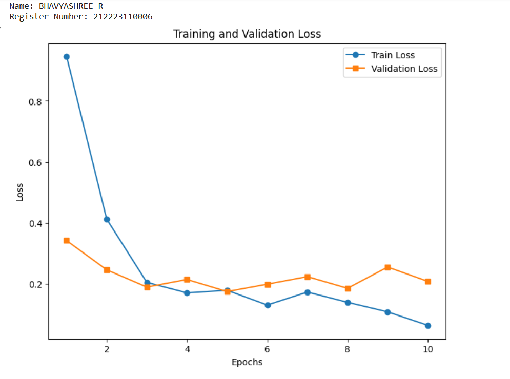
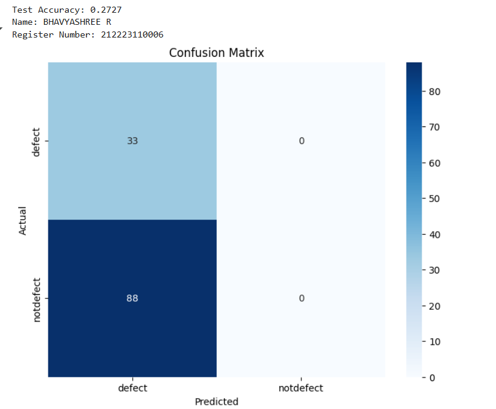
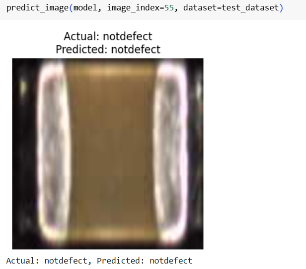
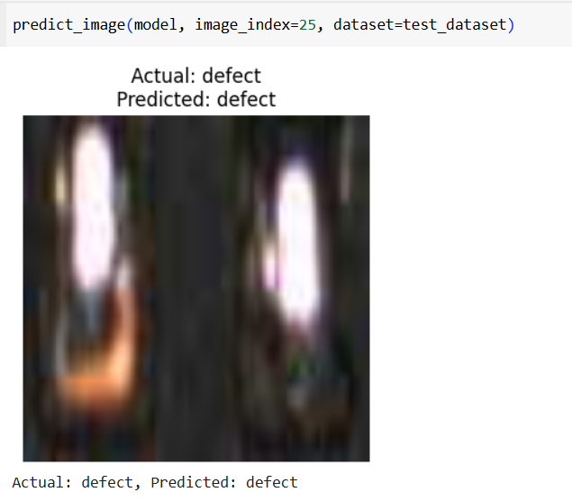

# Implementation-of-Transfer-Learning
## Aim
To Implement Transfer Learning for classification using VGG-19 architecture.
## Problem Statement and Dataset
Develop an image classification model using transfer learning with the pre-trained VGG19 model.
</br>
</br>
</br>

## DESIGN STEPS

### STEP 1:
Import required libraries.Then dataset is loaded and define the training and testing dataset.
### STEP 2:
initialize the model,loss function,optimizer. CrossEntropyLoss for multi-class classification and Adam optimizer for efficient training.
### STEP 3:
Train the model with training dataset.
### STEP 4:
Evaluate the model with testing dataset.
### STEP 5:
Make Predictions on New Data.

## PROGRAM
Include your code here
```python
# Load Pretrained Model and Modify for Transfer Learning
from torchvision.models import VGG19_Weights
model = models.vgg19(weights = VGG19_Weights.DEFAULT)

# Modify the final fully connected layer to match the dataset classes
in_features = model.classifier[-1].in_features
model.classifier[-1] = nn.Linear(in_features, len(train_dataset.classes))

# Include the Loss function and optimizer
criterion = nn.CrossEntropyLoss()
optimizer = optim.Adam(model.parameters(), lr=0.001)

# Train the model
def train_model(model, train_loader,test_loader,num_epochs=10):
    train_losses = []
    val_losses = []
    model.train()
    for epoch in range(num_epochs):
        running_loss = 0.0
        for images, labels in train_loader:
            images, labels = images.to(device), labels.to(device)
            optimizer.zero_grad()
            outputs = model(images)
            loss = criterion(outputs, labels)
            loss.backward()
            optimizer.step()
            running_loss += loss.item()
        train_losses.append(running_loss / len(train_loader))

        
        model.eval()
        val_loss = 0.0
        with torch.no_grad():
            for images, labels in test_loader:
                images, labels = images.to(device), labels.to(device)
                outputs = model(images)
                loss = criterion(outputs, labels)
                val_loss += loss.item()

        val_losses.append(val_loss / len(test_loader))
        model.train()

        print(f'Epoch [{epoch+1}/{num_epochs}], Train Loss: {train_losses[-1]:.4f}, Validation Loss: {val_losses[-1]:.4f}')

   
    plt.figure(figsize=(8, 6))
    plt.plot(range(1, num_epochs + 1), train_losses, label='Train Loss', marker='o')
    plt.plot(range(1, num_epochs + 1), val_losses, label='Validation Loss', marker='s')
    plt.xlabel('Epochs')
    plt.ylabel('Loss')
    plt.title('Training and Validation Loss')
    plt.legend()
    plt.show()

```

## OUTPUT
### Training Loss, Validation Loss Vs Iteration Plot


### Confusion Matrix


### Classification Report


### New Sample Prediction



## RESULT
Thus, the transfer Learning for classification using VGG-19 architecture has succesfully implemented.